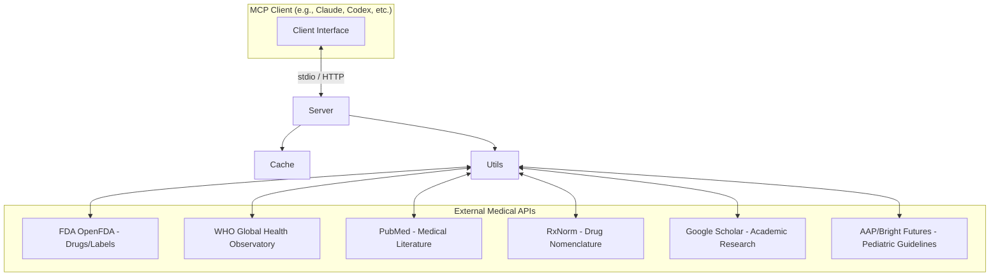

# mcp

Model Context Protocol (MCP) server that provides comprehensive medical information by querying multiple authoritative medical APIs.

## 🚀 Overview

`medical/dental-mcp` is a specialized MCP server designed to bridge the gap between LLMs and highly reliable medical databases. It provides structured, real-time access to critical healthcare information, including drug databases, medical literature, and global health statistics.

The server supports both **stdio** (for local CLI/IDE integration) and **HTTP** (for remote or web-based usage) transports.

## 🛠 Architecture

The server acts as an intermediary layer between the MCP client and various authoritative medical data sources.



## 📂 Project Structure

```text
mcp/
├── src/
│   ├── cache/          # In-memory cache management (hit/miss tracking, expiration)
│   ├── index.ts        # Server entry point, tool definitions, and transport setup
│   ├── utils.ts        # API query logic, data formatting, and safety helpers
│   ├── constants.ts    # API endpoints, user agents, and search patterns
│   ├── types.ts        # TypeScript interfaces for all medical data models
│   └── utils/          # Specialized utilities (e.g., deduplication)
├── scripts/            # Build and deployment scripts
├── test/               # Jest test suites
├── package.json        # Dependencies and scripts (e.g., build, start, dev)
├── tsconfig.json       # TypeScript configuration
└── README.md           # Project documentation
```

## ⚙️ Key Features & Tools

The server exposes several powerful tools to the MCP client:

- **💊 Drug Information**:
  - `search-drugs`: Search FDA database for drug names/brands.
  - `get-drug-details`: Fetch deep specifics via NDC (National Drug Code).
  - `search-drug-nomenclature`: Standardized searches via RxNorm.
  - `search-pediatric-drugs`: FDA searches specifically filtered for pediatric labeling.
- **📚 Medical Literature**:
  - `search-medical-literature`: Query PubMed for research articles.
  - `get-article-details`: Retrieve detailed abstracts and metadata via PMID.
  - `search-google-scholar`: Access academic research via Google Scholar.
  - `search-medical-journals`: Focused searches in high-impact journals (NEJM, JAMA, etc.).
- **🌍 Global Health & Pediatrics**:
  - `get-health-statistics`: Access WHO Global Health Observatory data.
  - `get-child-health-statistics`: WHO indicators specifically for pediatric populations.
  - `search-pediatric-guidelines`: Access AAP (Bright Futures) and policy statements.
- **🔍 Multi-Database Search**:
  - `search-medical-databases`: An aggregate tool searching PubMed, Scholar, Cochrane, and ClinicalTrials.gov simultaneously.
- **📊 System Monitoring**:
  - `get-cache-stats`: Monitor server performance (hit rates, memory usage).

## 🚀 Getting Started

### Prerequisites
- Node.js (v18+)
- npm

### Installation

1. Clone the repository:
   ```bash
   git clone <repository-url>
   cd medical-mcp
   ```

2. Install dependencies:
   ```bash
   npm install
   ```

3. Build the project:
   ```bash
   npm run build
   ```

### Running the Server

#### 1. Stdio Mode (Default)
Used for local integration with any agent, i.e., durian
```bash
npm run start
```

#### 2. HTTP Mode
Used for web-based or remote MCP connections.
```bash
npm run start:http -- --port=3000
```
Health and integration metadata is available at:
```bash
curl http://localhost:3000/health
```

### Redis Cache

The server uses its existing in-memory cache by default. To share cached API responses across processes or deployments, provide a Redis connection string:

```bash
REDIS_URL=redis://localhost:6379 npm run start:http -- --port=3000
```

Optional cache settings:

```bash
CACHE_BACKEND=redis
REDIS_CACHE_ENABLED=true
REDIS_CACHE_PREFIX=medical-mcp:cache:
REDIS_CONNECT_TIMEOUT_MS=5000
```

If Redis is unavailable, the server logs the connection error and falls back to the in-memory cache so medical tools can still run.

### CopilotKit

CopilotKit can connect to this server through the streamable HTTP MCP endpoint:

```ts
import { BuiltInAgent } from "@copilotkit/runtime/v2";

export const builtInAgent = new BuiltInAgent({
  model: "openai:gpt-5.4-mini",
  mcpServers: [
    {
      type: "http",
      url: "http://localhost:3000/mcp",
    },
  ],
});
```

For deployed environments, replace the URL with your public HTTPS `/mcp` endpoint. The `/health` response also includes a CopilotKit-ready `mcpServers` array for the current host and port.

### 🧪 Testing
Run the full test suite using Jest:
```bash
npm test
```

## ⚠️ Safety & Disclaimer

**IMPORTANT: This server is for educational and informational purposes only.**

- **NO CLINICAL DECISIONS**: Never use information from this server as the sole basis for medical or clinical decisions.
- **CONSULT PROFESSIONALS**: Always consult a qualified healthcare professional for patient care.
- **DYNAMIC DATA**: Data is retrieved live from external APIs. Accuracy depends on the availability and state of the source databases (FDA, WHO, etc.).
